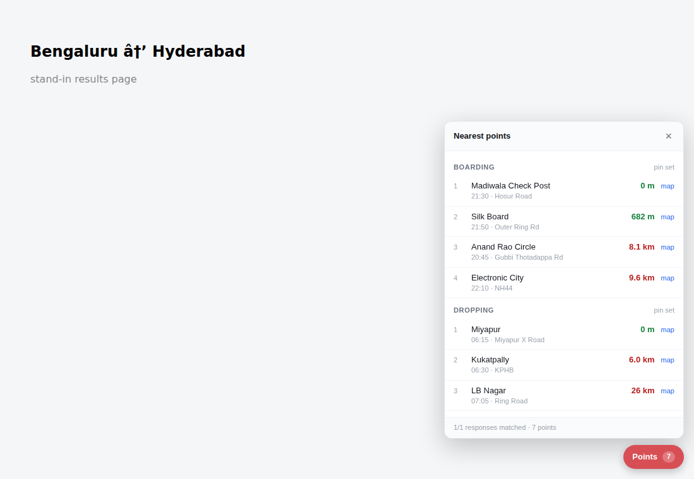

# redBus Point Picker

Drop two pins on a map once — where you're leaving from, where you're going —
and every redBus boarding and dropping point gets ranked by how far it actually
is from them. No more searching each point name in Maps one at a time.



## Status

Phase 1, confirmed working against the real site.

**redBus returns coordinates for its boarding and dropping points.** That was
the open question the whole design hinged on, and it's now answered from live
use — distances render without any geocoding step. Phase 4 (resolving point
names to coordinates) is therefore not needed for the common case.

## Install

Chrome / Edge:

1. `chrome://extensions` → enable **Developer mode**
2. **Load unpacked** → select this folder

Firefox (desktop, 128+):

1. `about:debugging#/runtime/this-firefox` → **Load Temporary Add-on**
2. Pick `manifest.json`

## Use

1. Click the toolbar icon. **Search for a place** — results are scoped to India
   and biased toward whatever the map is currently showing, so "Madiwala"
   resolves to the one you mean. Pick a result to set the selected pin. You can
   also tap the map directly, drag a pin to fine-tune, or paste
   `12.9716, 77.5946` (a Google Maps URL works too).
2. Save them as named locations — you almost certainly reuse the same two or
   three, and then you never open the picker again.
3. Search on redbus.in. A **Points** button appears bottom-right; the panel
   lists the nearest boarding and dropping points with distances and a `map`
   link for walking directions.

Distances are straight-line, which is the right metric for *ranking* candidates
but can mislead where a river or flyover sits between you and the point. The
`map` link is there for exactly that check on your top two or three.

## When something looks wrong

Open the popup → expand **Developer / recon** (it's a collapsed section; click
the summary line) and tick **Debug logging**. Capture activity then prints to
the console on the redbus.in tab — payloads seen, points extracted, journey
changes, and anything the adapter choked on. Without it the extension is
deliberately silent: every risky path is wrapped so instrumentation can't break
the page, which also means failures leave no trace.

If points are found but carry no coordinates, the panel says so rather than
showing blank distances — that's the case Phase 4 would cover.

For schema work, tick **Capture mode** too, run a search, then **Export
captures**. The export contains, for each captured response:

- `discoveries` — every array scored on how much it resembles a stop list,
  with the signals that fired and its JSON path
- `shape` — the payload structure with arrays collapsed, readable at a glance
- `withCoords` / `withoutCoords` — the actual answer to the question above

Turn capture mode back off afterwards; it stores raw payloads.

## Tests

```sh
npm test        # 54 unit tests, no dependencies
npm run smoke   # loads the real extension into Chromium against a local stand-in
```

The smoke test needs Playwright and skips cleanly without it. It exercises the
part unit tests can't: MAIN-world fetch patching, the cross-world message hop,
storage round-trip, and the rendered panel.

## Mobile

Not yet, and the ceiling is lower than it looks: Chrome for Android has never
supported extensions, and Kiwi is discontinued. Firefox for Android (128+) runs
MV3 and is the only realistic target — the code is kept Firefox-compatible for
that reason. Integrating with the redBus **native app** is a different product
entirely; ARCHITECTURE.md sketches what it would cost.

## Scope and etiquette

This reads data redBus already sent to your own browser, in your own session.
It adds no requests of its own and does not automate anything on the site. If
later phases start fetching point lists for every bus in a result set, that
should be throttled and cached — see ARCHITECTURE.md.
